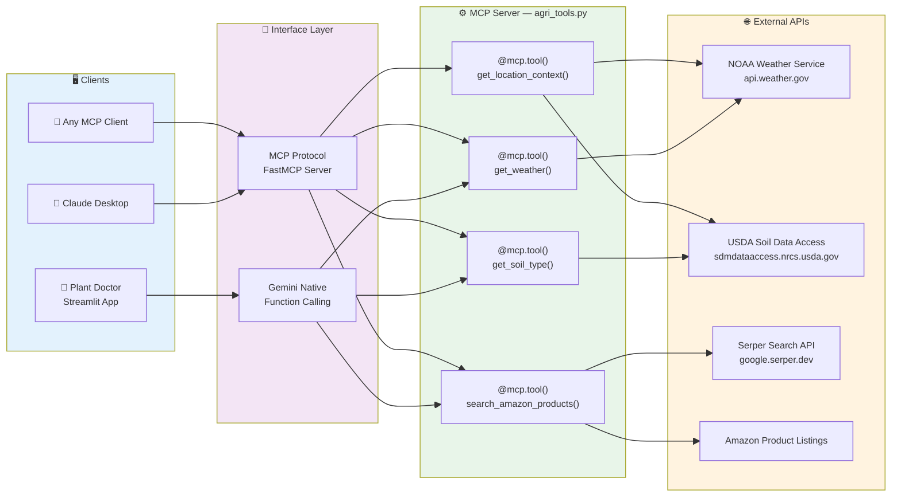

# Workflow 2: MCP Server Architecture

> **Chapter 9.2** — Integrating specialist tools and external APIs via Model Context Protocol

This diagram shows how the agricultural tools are exposed via the Model Context Protocol (MCP), enabling both the internal Gemini agent and external clients (Claude Desktop, etc.) to discover and invoke the same tools.

## Dual Interface Pattern

The same tool implementations serve two interfaces:

| Interface | Used By | Discovery | Schema |
|-----------|---------|-----------|--------|
| Gemini Native Function Calling | Plant Doctor app internally | Python function signatures | Auto-inferred |
| MCP Protocol (FastMCP) | Claude Desktop, external agents | `@mcp.tool()` decorators | JSON Schema |

This demonstrates **Section 9.2's** principle: specialist tools should be written once and exposed through standardized boundaries so any compliant agent can consume them.
