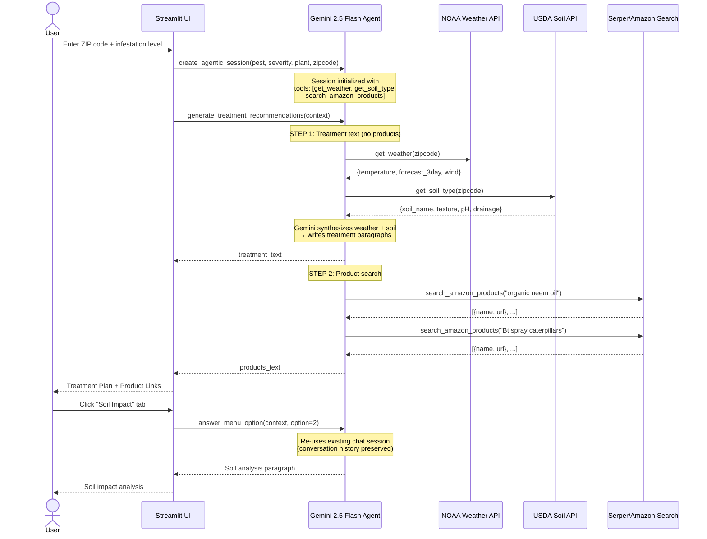

# Workflow 3: Gemini Tool-Calling Sequence

> **Chapter 9.2** — Integrating specialist tools: how Gemini autonomously orchestrates multi-tool calls

This sequence diagram traces the exact message flow between the Streamlit UI, the Gemini agent, and each external tool during a treatment recommendation generation.

## Agentic Autonomy

The agent decides **which tools to call and in what order** based solely on the prompt. There is no hard-coded orchestration — Gemini reads the context and determines:
1. Weather data is needed → calls `get_weather()`
2. Soil data is needed → calls `get_soil_type()`
3. Products are requested → calls `search_amazon_products()` 2–3 times with specific queries

This is the core demonstration of **Section 9.2**: the LLM acts as the orchestrator, not as a simple function router.
