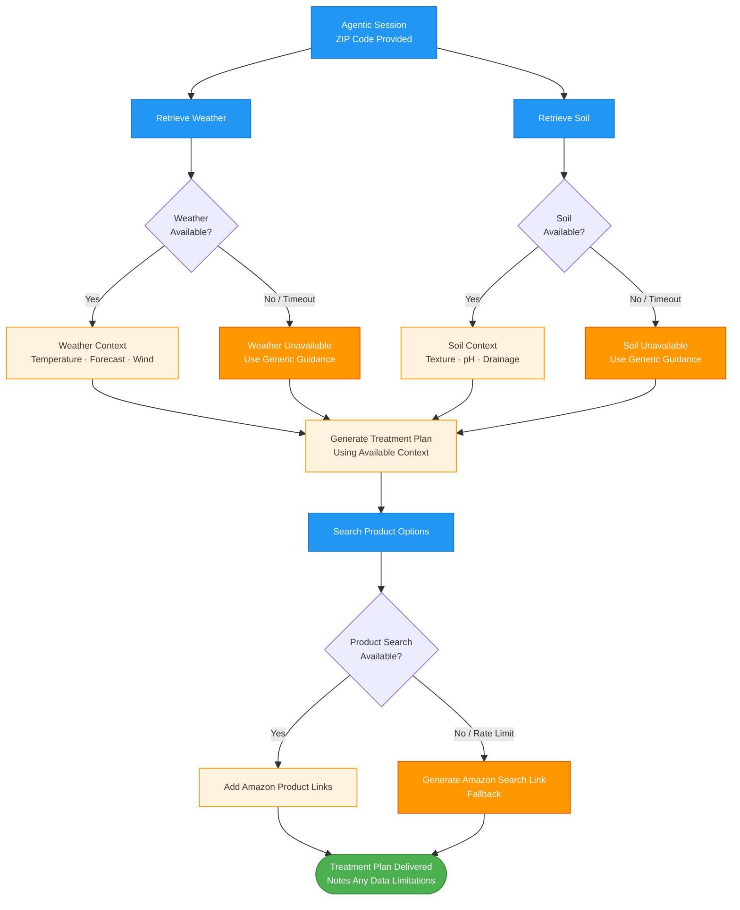

# Workflow 5: Graceful Degradation Under Incomplete Context

> **Chapter 9.3** — Graceful degradation under incomplete context

This diagram shows how the Plant Doctor handles failures at each external dependency — weather API, soil API, and product search — without crashing or producing empty responses.

## Degradation Strategy

The system follows a **best-effort delivery** principle:

1. **API failures** return structured error dicts, not exceptions — the agent always receives *something*
2. **`format_*_display()` functions** check for the `"error"` key and return a human-readable warning string
3. **Gemini still generates** useful generic treatment advice even when location data is missing
4. **Product search fallback** builds an Amazon search URL from the query string, so the user always gets a clickable link
5. **No hard crashes** — `try/except` blocks at every external call boundary

This maps directly to **Section 9.3's** principle: an agent that silently degrades is safer than one that throws unhandled exceptions in production.
